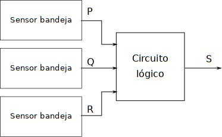
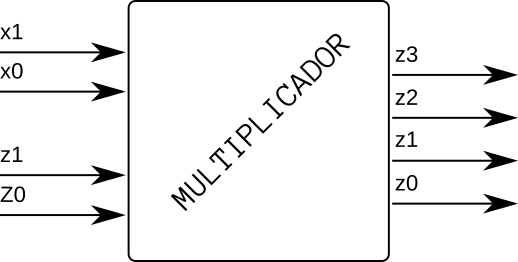
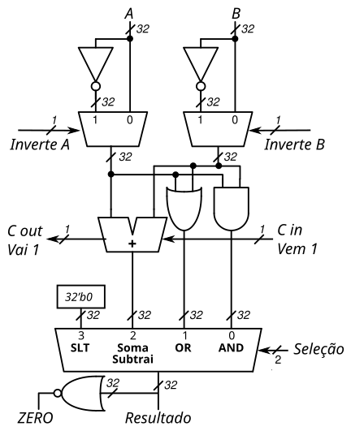

# AV2 - Simulado - bits e proc

1. Teórica (blackboard)
1. Prática (github)

Você possui um total de 1h20 para realizar a avaliação, você pode decidir
como usar o seu tempo.

- **NÃO PODE USAR O GITHUB COPILOT**
- **Trabalhar sozinho**
- **1h20 min**
- **REALIZAR UM COMMIT (A CADA QUESTÃO) E DAR PUSH AO FINALIZAR**

## Começando

Você deve:

1. clonar o repositório que foi gerado pelo link (e trabalhar nele)
1. editar o arquivo `ALUNO.yml`
1. não esqueça de dar `commit` e `push` a cada questão

> Todas as questões possuem testes, para executar: `pytest -k QUESTAO`

### Questão 1

| Módulo          | pnts   |
| --------------- | ------ |
| `exe1(a,b,c,q)` | 2 (HW) |

- Testar com: `pytest -k exe1 -s`

Implemente o circuito a seguir em MyHDL

- `a`, `b`, `c` e `q`: São sinais do tipo `bool`

## Questão 2

| Arquivo         | pnts   |
| --------------- | ------ |
| `exe2(p,q,r,s)` | 4 (HW) |

- Testar com: `pytest -k exe2 -s`

Você deve desenvolver um circuito em MyHDL que resolve o problema a seguir.

Veja a Figura a seguir. Em uma simples máquina copiadora, um sinal de parada (S) é acionado (ALTO) para interromper a operação da máquina e ativar um indicador luminoso, sempre que uma das condições a seguir ocorrer:

1. a bandeja de alimentação de papel estiver vazia (P) ou
1. duas microchaves sensoras de papel (Q, R) estiverem acionadas simultaneamente, indicando um atolamento de papel.

A presença de papel na bandeja de alimentação é indicada por um nível ALTO no sinal lógico P. Cada uma das microchaves (P,Q) produz sinais lógicos ALTO sempre que um papel estiver passando por ela.

- `p`, `q`, `r` e `s`: São sinais do tipo `bool`

## Questão 3

| Arquivo                | pnts   |
| ---------------------- | ------ |
| (a) Resolução no papel | 6 (HW) |
| (b) `exe3(x, y, z)`    | 4 (HW) |

A Figura a seguir representa um circuito multiplicador de números inteiros positivos (unsigned) que recebe dois números binários de dois bits: `x1x0` e `y1y0` e gera um número binário de quatro bits de saída: `z3z2z1z0` igual ao produto aritmético dos dois números de entrada.

### (a)

> No papel

Encontre a equação que realiza a multiplicação entre dois vetores de dois bits cada x e y e resulta em um vetor de quatro bits z e então implemente a solução em MyHDL.

### (b)

Implemente em MyHDL a solução para o multiplicador.

- Testar com: `pytest -k exe3 -s`

- `x1`, `x0`, `y1`, `y0`: São entradas do tipo `bool()`
- `z3`, `z2`, `z1`, `z0`: Saída do tipo `bool()`

## Questão 4

| Arquivo                | pnts   |
| ---------------------- | ------ |
| (a) Resolução no papel | 6 (HW) |
| (b) `exe4_ula`         | 8 (HW) |

A ULA a seguir é utilizada no processador chamado MIPS:

E possui as conexões:

- Pontos de controle: `InverteA`, `InverteB`, `Vem 1`, `Seleção (2 bits)`.
- Entradas: `A`, `B`.
- Saídas: `Resultado`, `ZERO`, `Vai1`.

A seleção de cada mux está indicada no desenho. Por exemplo, no mux `Inverte A`, o sinal de controle em nível baixo (zero) selecionará a entrada 0. E, consequentemente, se o nível do sinal de controle for alto (um), selecionará a entrada 1.

### (a) Entendendo a ULA

> No papel

Preencha o estado dos pinos de controle para cada uma das funções abaixo.

| Função         | InverteA | InverteB | Vem 1 | Seleção (bit 1) | Seleção (bit 0) |
| -------------- | -------- | -------- | ----- | --------------- | --------------- |
| `A + B`        |          |          |       |                 |                 |
| `A - B`        |          |          |       |                 |                 |
| `B - A`        |          |          |       |                 |                 |
| `A nor B`      |          |          |       |                 |                 |
| `A nand B`     |          |          |       |                 |                 |
| `(notA) and B` |          |          |       |                 |                 |
| `A or (notB)`  |          |          |       |                 |                 |
| `?(A == B)`    |          |          |       |                 |                 |

- `?(A == B)`: Como verificar se o vetor de entrada 'A' é igual a 'B'?

### b)

| Arquivo                                                                       | pnts   |
| ----------------------------------------------------------------------------- | ------ |
| `exe4_ula(a, b, inverte_a, inverte_b, c_in, c_out, selecao, zero, resultado)` | 6 (HW) |

- Testar com `pytest -k exe4_ula`

Implemente a ULA em MyHDL utilizando os componentes (que já estão implementados no arquivo `ula_aux.py`): `mux2Way`, `adder`, `mux4way` .

## Extras

Ideias que eu tive ideia quando estava construindo o simulado:

- Perguntar como a ULA da família 7400 funciona: https://en.wikipedia.org/wiki/74181

- Fazer um módulo que calcula CRC? https://pt.wikipedia.org/wiki/CRC

- Qual o papel da ULA?

- O que é lógica combinacional.

- Como um somador funciona?

- Algo similar ao display de 7 segmentos... não sei o que exatamente.

- O exemplo

- (meio viagem) Um módulo que recebe um pacote TCP e verifica alguns campos. (https://www.vskills.in/certification/tutorial/tcp-ip-packet-formats-and-ports/)
